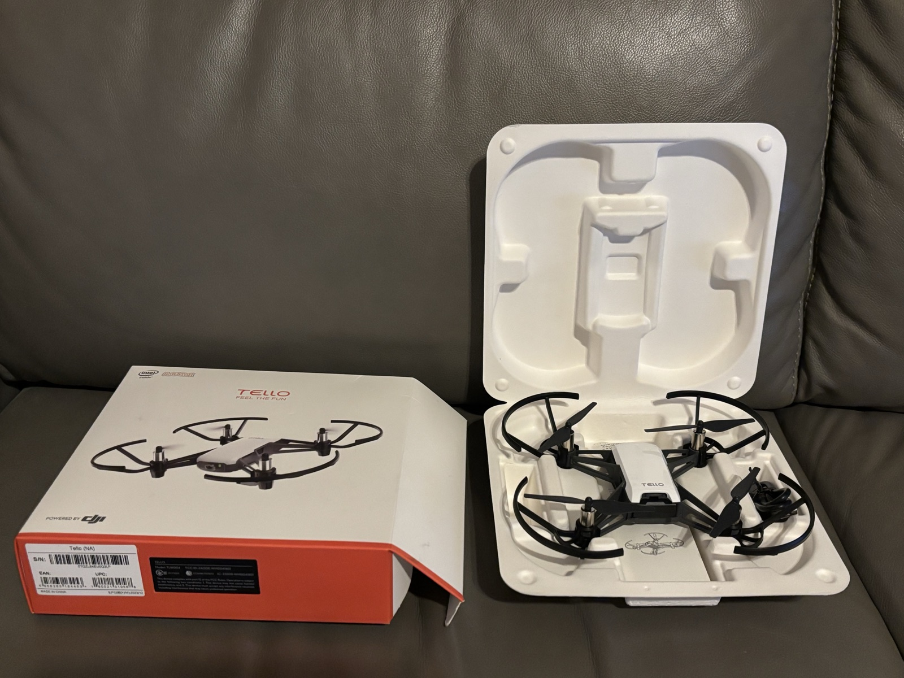
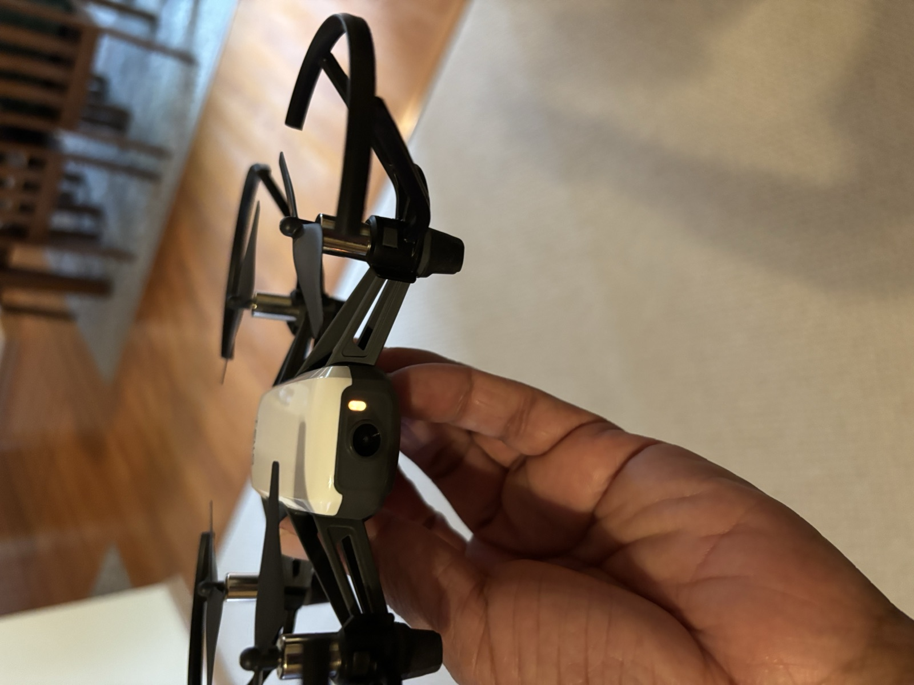

# Ryze DJI Tello Drone — Python Controller

A Python application to autonomously control the Ryze DJI Tello drone, built incrementally. All features are accessible through a GUI or driven directly from YAML mission files.

**Status:** ✅ Hover controller, GUI, and Live Video feed verified on real hardware (macOS).

---

## Hardware Demo

The Ryze DJI Tello, straight out of the box:

<p align="center">
  
  
</p>

**Drone in flight** (autonomous hover sequence): [`images/drone_flight.mp4`](images/drone_flight.mp4)

**GUI controller demo** (Hover Test tab, real flight): [`images/gui_demo.mp4`](images/gui_demo.mp4)

---

## Requirements

- Python 3.10+
- Ryze DJI Tello drone
- WiFi connection to the drone (connect your machine to the Tello's WiFi hotspot before running)

## Setup

```bash
git clone https://github.com/gkrangan/ryze-dji-tello-drone.git
cd ryze-dji-tello-drone
python3 -m venv .venv
source .venv/bin/activate
pip install -r requirements.txt
```

---

## GUI Controller

The easiest way to fly. Covers all features in a single window.

```bash
python tello_gui.py
```

**Tabs:**

| Tab | What it does |
|-----|-------------|
| Hover Test | Takeoff → hold height for a set duration → land |
| Mission File | Load and run any YAML mission from the `missions/` folder |
| Pattern Flight | Fly a square, circle, or figure-8 at a chosen size and speed |
| Live Video | Live camera feed with telemetry HUD, face/color detection overlays, snapshot, and MP4 recording |

**Controls:**
- **Dry Run** checkbox — simulate the full sequence without connecting to the drone
- **▶ Run** — start the selected tab's flight
- **■ Stop** — graceful stop and land mid-mission
- **⬇ EMERGENCY LAND** — immediate land at any time, even outside a mission

---

## CLI — Hover Controller

Standalone script for quick hover tests without the GUI.

```bash
python tello_hover.py                        # defaults: 3ft, 10s
python tello_hover.py --height 5 --time 30  # 5ft hover for 30s
python tello_hover.py --dry-run             # simulate without drone
```

| Argument | Default | Description |
|----------|---------|-------------|
| `--height` | `3.0` | Hover height in feet |
| `--time` | `10` | Hover duration in seconds |
| `--dry-run` | off | Simulate flight without connecting |

Type `land` + Enter or press `Ctrl+C` to land immediately.

---

## Mission Files

Missions are YAML files that define a sequence of actions. Load them from the GUI's **Mission File** tab, or run them directly in code:

```python
from tello_mission import MissionExecutor
mission = MissionExecutor.load_yaml("missions/square_pattern.yaml")
MissionExecutor(dry_run=True).run(mission)
```

### Actions

#### `takeoff`
```yaml
- type: takeoff
  height_ft: 3        # optional — adjusts to this height after takeoff
```

#### `land`
```yaml
- type: land
```

#### `hover`
```yaml
- type: hover
  height_ft: 4        # optional — adjust height before hovering
  duration_secs: 10
```

#### `move`
Direction-based (simple):
```yaml
- type: move
  direction: forward  # forward, back, left, right, up, down
  distance_cm: 100
  speed: 30
```
3D coordinate (advanced):
```yaml
- type: move
  x: 100    # forward (+) / backward (-)
  y: 50     # left (+) / right (-)
  z: 0      # up (+) / down (-)
  speed: 30
```

#### `rotate`
```yaml
- type: rotate
  direction: clockwise    # clockwise or counter-clockwise
  degrees: 90
```

#### `pattern`
```yaml
- type: pattern
  shape: square     # square, circle, figure-8
  size_cm: 100      # side length (square) or radius (circle/figure-8)
  speed: 30
```

#### `on_detect`
```yaml
- type: on_detect
  target: face      # face or color
  color: red        # red, green, blue, yellow (only if target: color)
  on_found: hover   # hover (stop in place) or land
  timeout_secs: 15
```

### Example missions

| File | Description |
|------|-------------|
| `missions/hover_test.yaml` | Basic takeoff → hover → land |
| `missions/square_pattern.yaml` | Fly a 1m × 1m square at 4ft |
| `missions/circle_pattern.yaml` | Fly a circle with 80cm radius |
| `missions/figure8_pattern.yaml` | Fly a figure-8 |
| `missions/cv_face_detect.yaml` | Hover and scan for a face; hold in place when found |
| `missions/cv_color_detect.yaml` | Hover and scan for a red object; land when found |

---

## Notes

- The Tello SDK enforces a **20cm minimum** per single-axis move. If the target height is within ±20cm of the post-takeoff position (~80cm), no adjustment is issued.
- Battery below 20% will show a warning before flight. The drone auto-lands when battery is critically low.
- Circle and figure-8 patterns use continuous RC control. Radius accuracy depends on the drone's speed-to-yaw-rate ratio and may vary slightly in practice.
- `on_detect` requires the drone's front camera stream (`streamon`). It is not available in dry-run mode.

---

## Roadmap

- [x] Hover controller — takeoff, hold height, land on command
- [x] Mission file — YAML-driven sequential action execution
- [x] Waypoint navigation — directional and 3D coordinate moves
- [x] Pattern flight — square, circle, figure-8
- [x] Computer vision triggers — face and color detection
- [x] GUI — tabbed interface with live log and emergency land
- [x] Live video feed — embedded camera stream with overlays, snapshot, and recording
- [ ] Follow mode — track a detected object in real time
- [ ] Concurrent mission + video — share a single drone connection
